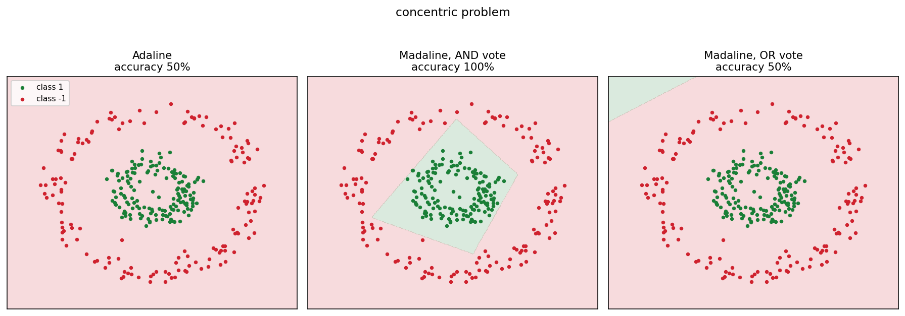

# Classical Neural Networks

Three of the models that came before backpropagation, implemented from scratch:
the McCulloch-Pitts threshold neuron, Adaline, and Madaline. Each is a step in
what a network can represent, and the point of putting them side by side is to
see exactly where each one stops.



## Requirements

Python 3.10 or later. numpy for the models, matplotlib for the figures.

## Installation

```bash
pip install -e .
```

With the test suite:

```bash
pip install -e ".[dev]"
```

## Demo

```bash
python -m classic_nets.demo
```

Fits every model on every problem, writing one figure per problem to `docs/` and
the scores to `results/scores.json`.

## Results

Accuracy on three two-dimensional problems, 8 hidden units, seed 0.

| problem | Adaline | Madaline, AND | Madaline, OR |
| --- | --- | --- | --- |
| linearly separable | 1.00 | 1.00 | 1.00 |
| concentric rings | 0.50 | **1.00** | 0.50 |
| XOR | 0.50 | 0.50 | 0.79 |

Two classes throughout, so 0.50 is chance.

Every one of those numbers follows from what the architecture can express, and
none of them is a tuning artefact.

**Adaline is one straight line.** It solves the separable problem exactly and
sits at chance on the other two. No learning rate or epoch count changes that,
because no line divides a ring from the disc inside it.

**Madaline's vote decides the shape of the region.** Each hidden unit is a
half-plane. An AND fires only when every unit does, giving their intersection,
which is convex. An OR gives their union, whose complement is convex. The
concentric problem has a convex positive class, so the AND vote solves it
completely and the OR vote cannot touch it. The middle panel above shows the
intersection directly: a convex polygon closing around the inner disc, one edge
per hidden unit.

**Neither vote solves XOR, at any width.** XOR's positive class is two separate
patches, and neither an intersection of half-planes nor a union of them is two
patches. Adding hidden units does not help, because the limit is the fixed output
layer rather than the capacity beneath it. Getting past this is what a trained
output layer, and backpropagation, are for. A test asserts it fails at 4 and 16
units under both votes.

## The models

**McCulloch-Pitts, 1943.** No learning at all. Weights and a threshold are chosen
by hand, and the unit fires when the weighted sum reaches the threshold. It is
the smallest thing that computes a logical function; `logical_and`,
`logical_or` and `logical_not` are three lines each, and a test composes them
into XOR to show that two layers of fixed units already suffice for it.

**Adaline.** Trained by the Widrow-Hoff rule, which is the whole difference from
the perceptron: the update uses the error before thresholding rather than after.
A perceptron learns nothing from a sample it classifies correctly by a hair,
while Adaline measures the actual distance from the target, giving a smooth
squared-error surface with a gradient everywhere on it.

**Madaline.** A hidden layer of Adalines under a fixed vote, trained by the MRI
rule. When the output is wrong, only the units at fault are adjusted, and only
enough to flip them: where a single unit must change, the one nearest its own
threshold is chosen as the cheapest.

The MRI step is divided by the squared norm of the augmented input. Without that
the correction scales with the size of the input, so a large sample produces a
large weight change, a larger activation, and a larger correction again. The
weights diverge within a few epochs.

## Project structure

```
classic_nets/
    mcculloch_pitts.py  the threshold unit and the logic gates
    adaline.py          the Widrow-Hoff learning rule
    madaline.py         the hidden layer, the vote, the MRI rule
    datasets.py         separable, concentric and XOR problems
    figures.py          decision boundary plots
    demo.py             the full comparison run
tests/                  gate behaviour, learning, and representational limits
docs/                   one figure per problem
results/                scores from the most recent run
pyproject.toml          packaging
```

## Components

| module | responsibility |
| --- | --- |
| `mcculloch_pitts` | Fixed threshold units and the gates built from them |
| `adaline` | A single linear unit and its learning rule |
| `madaline` | The hidden layer, both votes, and MRI training |
| `datasets` | Problems chosen to separate the models |
| `figures` | Drawing a fitted model's decision boundary |
| `demo` | Fitting everything and writing the artefacts |

## Testing

```bash
python -m pytest tests/
```

Nineteen tests. The gates are checked against their truth tables, XOR is
composed from three fixed units, Adaline is shown to solve the separable problem
and fail the concentric one, the AND vote is shown to beat the OR vote where
convexity says it should, and both are shown to fail XOR at any width.
